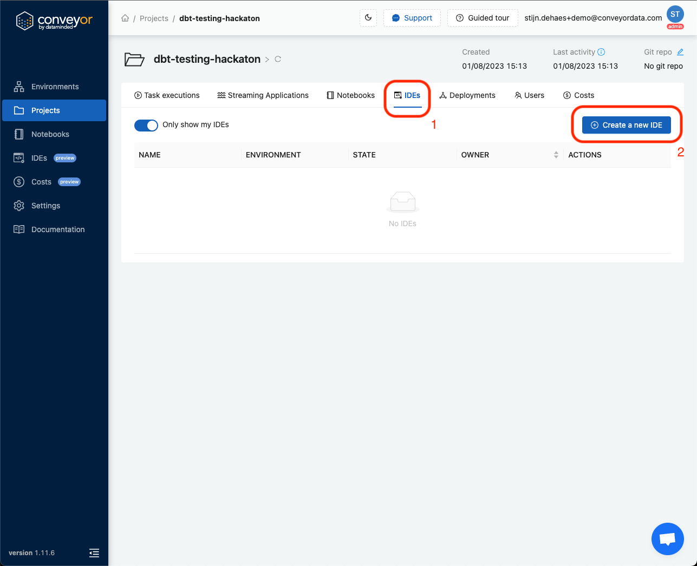
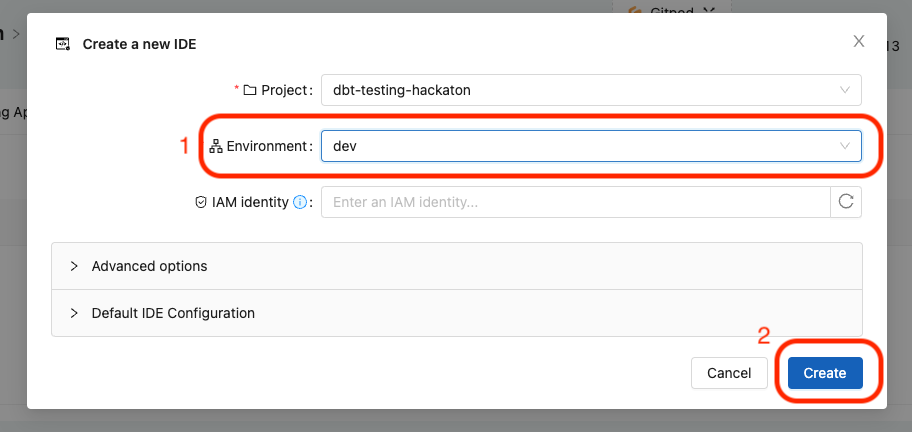
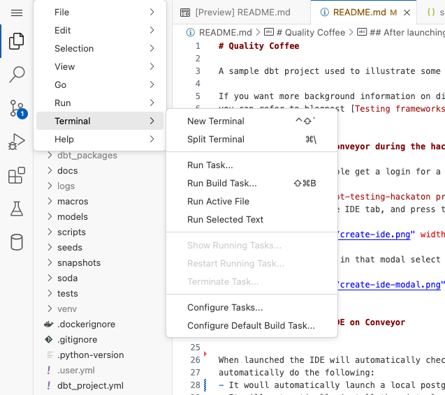
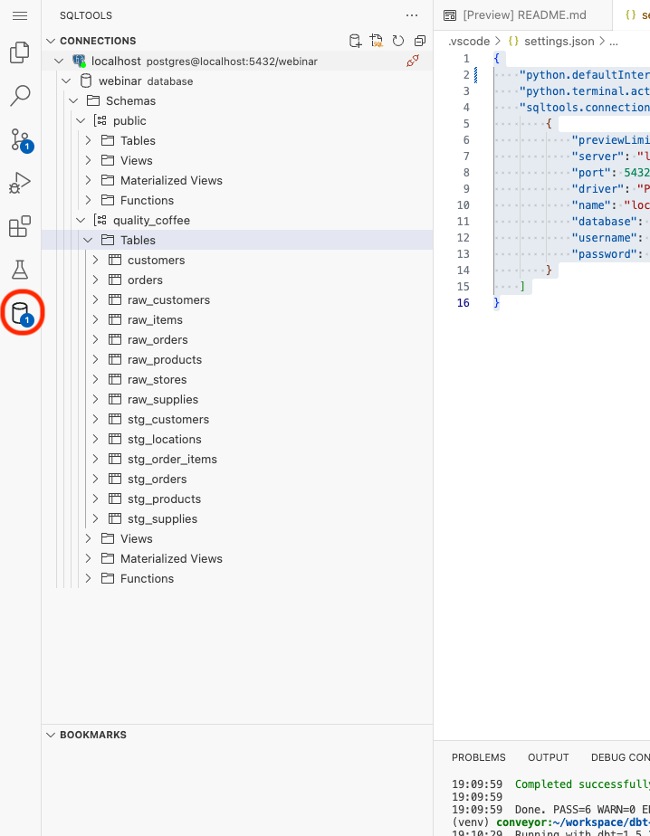
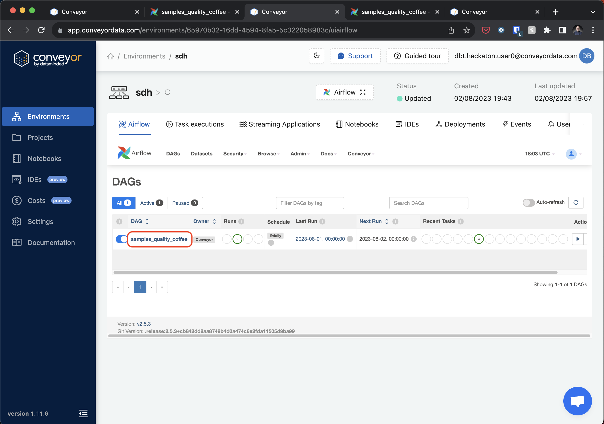
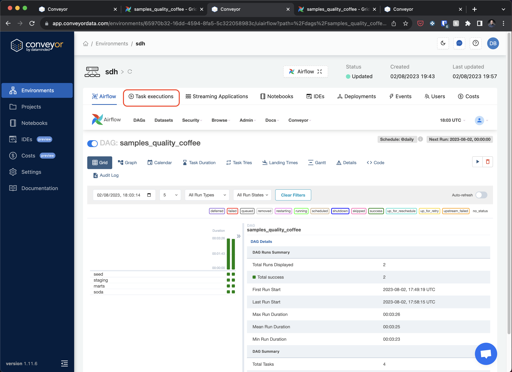
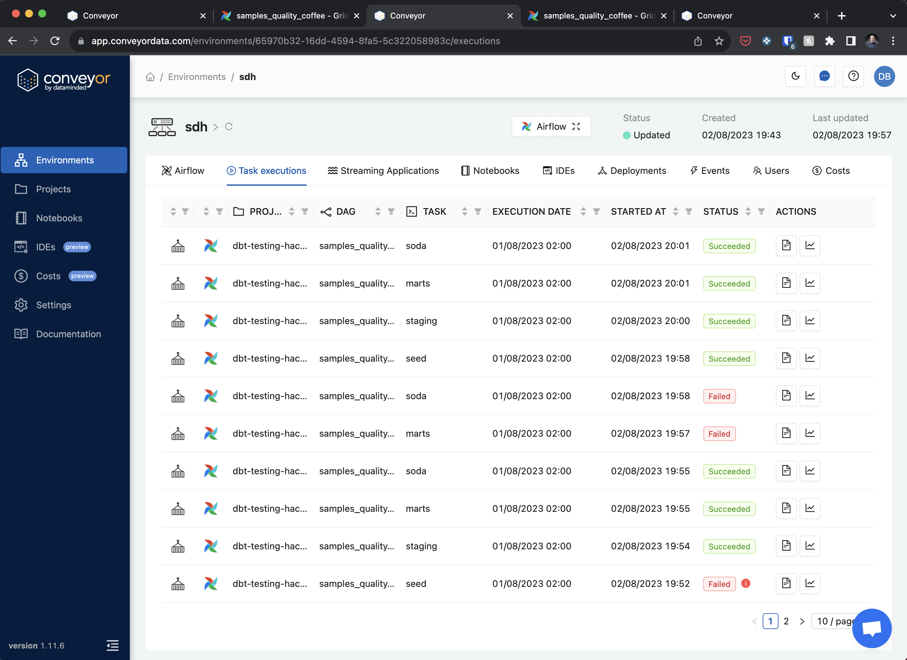

# Quality Coffee

A sample dbt project used to illustrate some best practices for testing your dbt code.

If you want more background information on different kinds of tests you can use with dbt,
you can refer to blogpost [Testing frameworks in dbt](https://medium.com/datamindedbe/testing-frameworks-in-dbt-3fa8933a5807).


## Getting started on Conveyor during the hackaton

During the Hackaton people get a login for a Conveyor installation,
please go to dbt-testing-hackaton project in Conveyor by following this [link](https://app.conveyordata.com/projects/bfeaa8a1-7aaa-45ca-b4b4-145edafdee4e/ides).

Please log in when prompted to do so. After logging in you should see the same windows as shown below.
Please press the button `create a new IDE`, to launch your IDE.



This will open a modal, in that modal select the `dev` environment and press the create button.




## After launching an IDE on Conveyor


When launched the IDE will automatically check out the project and automatically op this README again. It will also
automatically do the following:
- It woull automatically launch a local postgres server which can be used during the hackaton
- It will automatically install the virtual environment, and set up DBT and our testing packages.

Sometimes the python plugin shows a failure at the bottom right, when this happens you need to click on it and set the virtual environment
to:
```
use Python from `python.defaultInterpreterPath` setting `./venv/bin/python`
```

This works correctly 90% of the time. Don't hesitate to reach out if you need help during the hackaton. If there is no failure please just continue.

After this automatic setup is done you can start using dbt, to set up the necessary data. Open a terminal in vscode:




After that run the following command in the terminal to populate the database with fake data:

```bash
dbt seed
```

Running this command might take up to 3 minutes. The `dbt seed` command will populate our database with the
fake data from the seeds directory.

After that we can run all our dbt models using:

```bash
dbt run
```

This will create all our new models. You can use the included database viewer to have a look at the data:



## Experimenting with testing

After this we can start with experimenting with our first tests!

We have the following test starter docs:
- [Unit testing](./docs/unit-testing.md)
- [Testing with soda](./docs/soda.md)
- [Contract enforcement](./docs/enforcing-contracts.md)
- [Macro testing](./docs/macro-testing.md)


Some other data testing framework you could try out:
- [elementary](https://github.com/elementary-data/elementary)
- [re-data](https://github.com/re-data/re-data)

You can also scroll trough the list of projects with the [data-observability](https://github.com/topics/data-observability) tag on github.

## Running the project on Conveyor

Want to run the project on Conveyor? The following instructions help you build and deploy the project to an environment
on Conveyor.

First we need to create an environment, we can do this with the UI or the CLI. For today let's use the CLI.
We need to give an environment a name, I suggest your initials for today.
Open the terminal and execute the following command, after replacing your initials.

```bash
conveyor env create --name YOURINITIALS
```

After creating the environment we are ready to build and deploy our project, execute the follwing command:

```bash
conveyor build
```

This command will build your project, it will create a docker container from your code and will upload the Airflow dags
included in the [dags](dags) folder.

After we have created a build we can deploy it to the environment, please use the same environment name as before:

```bash
conveyor deploy --wait --env YOURINITIALS
```

This will register the container we just build as active on the environment, and will register the DAGs with Airflow.

We can view the environment by going to the following url: [https://app.conveyordata.com/environments](https://app.conveyordata.com/environments).
This will show you a list of environments. Find your and click on it this will show you Airflow. If you know Airflow
free to look around. Otherwise follow our guide to get to know a bit more of Airflow.

First click on the dag named `samples_quality_coffee`:



This will show you a screen that shows all the tasks defined in the Airflow DAG. They should sounds familier to you as 
they are:

- seed: runs DBT seed on Conveyor, you would normally not do this in production since you would be running on real data
- staging: Runs all our models in the [staging folder](./models/staging) 
- marts: Runs all our models in the [marts folder](./models/marts)
- soda: Runs our [soda script](./soda/run_soda.sh) after all our models are finished

You can see the logs of these jobs by pressing `task executions`:



This will show you a screen like this:



In here you can see many tasks and click on them to get some details and logs.

This concludes our short introduction to Conveyor, if you want to know more just talk to the people from Data Minded in
the hackaton.

